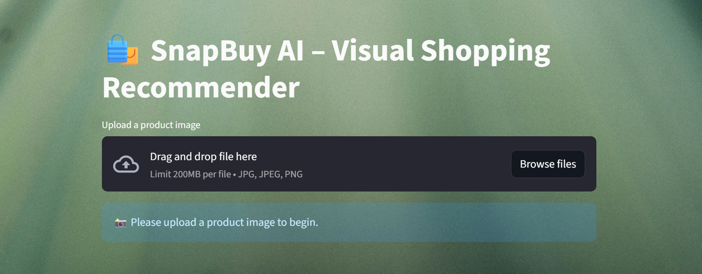
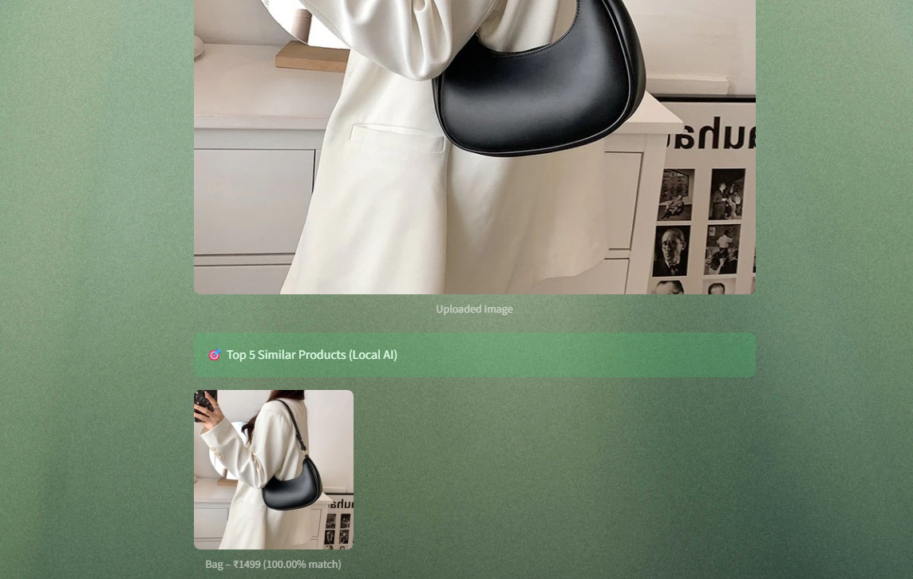

# 🛍️ SnapBuy AI – Visual Shopping Recommender

SnapBuy AI is an intelligent visual search system that lets users upload an image of a product and instantly get similar product recommendations — both from a local AI model **and live Google search results**.

🚀 [Live Demo on Streamlit](https://snapbuy-ai-k5lbwpm2jdzj5sms2kuus6.streamlit.app)

Built with ❤️ using **Streamlit**, **PyTorch (ResNet50)**, **FAISS**, and **Google Custom Search API**, this project brings real-world e-commerce experience into an interactive web app.

---

## 🔥 Features

- 📸 Upload any product image (like a shirt, bag, watch, etc.)
- 🧠 Get visually similar products using **ResNet50 + FAISS**
- 🌐 See real-time Google shopping results using **Custom Search API**
- 🎯 Shows image similarity score & clean UX
- 🌈 Beautiful UI with background image and loading spinners
- 🧾 Clean code, well-structured, and ready to deploy

---

## 💻 Tech Stack

| Component       | Stack                          |
|----------------|---------------------------------|
| Frontend UI     | Streamlit                       |
| Image Processing | PIL, NumPy                     |
| Feature Extraction | PyTorch ResNet50             |
| Similarity Search | FAISS                         |
| Live Web Search | Google Custom Search API        |
| File Structure  | Modular (app.py, utils.py, etc.)|

---

## 🖼️ Screenshots

| Upload Image | Product Matches | Google Results |
|--------------|-----------------|----------------|
|  |  |  |

---

## 🚀 How to Run Locally

1. Clone the repo:

```bash
git clone https://github.com/your-username/SnapBuy-AI.git
cd SnapBuy-AI
Install dependencies:

bash
Copy
Edit
pip install -r requirements.txt
Build product index:

bash
Copy
Edit
python build_index.py
Run the app:

bash
Copy
Edit
streamlit run app.py
🔑 Setup for Google Search
Create a Custom Search Engine here

Get your CSE ID and API key from Google Cloud Console

📦 Folder Structure
pgsql
Copy
Edit
SnapBuy-AI/
├── app.py
├── utils.py
├── build_index.py
├── google_search.py
├── products.json
├── product_images/
├── assets/bg.jpg
├── faiss.index
├── requirements.txt
└── README.md
📱 Live Demo (optional)
👉 Try it on Streamlit Cloud
(Replace with your link after deploy)

🙋‍♀️ Author
J.S. Lekshmi Priya
📍 Final Year, Android Developer
💡 Passionate about AI + App Development
📫 https://www.linkedin.com/in/lekshmi-priya-j-s--8684382a9/

🌟 Show Some Love
If you like this project, consider giving it a ⭐ on GitHub and sharing it on LinkedIn!
It helps others discover this and motivates me to build more cool stuff 💙
